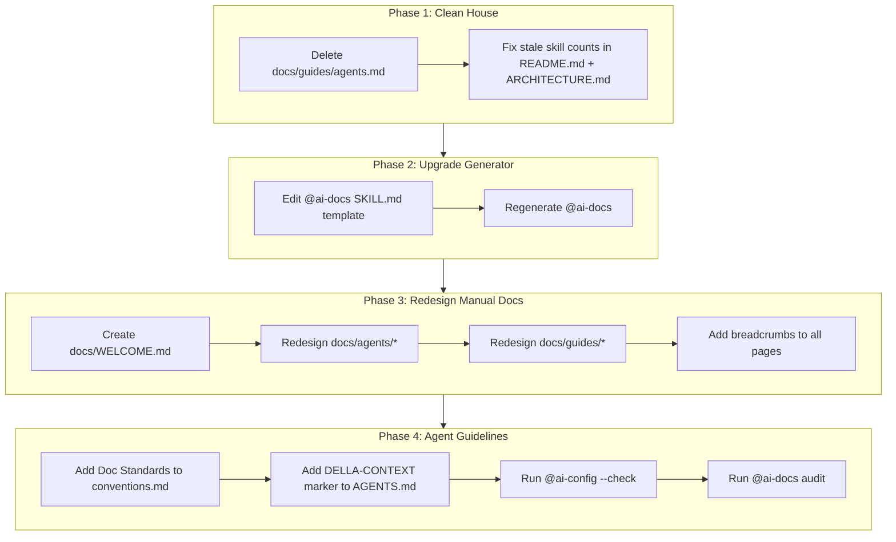

# Plan: Total Documentation Refactorization — "Better Documentation"

**Generated:** 2026-07-10 | **Model:** opencode-go/deepseek-v4-flash | **Version:** 1.0
**Request:** Refactorizar toda la documentación para que sea bonita, informativa, organizada, con pasos claros para agentes, y que los agentes entiendan qué documentar.

## Objective

Redesign the `docs/` tree from a scattered collection of Markdown files into a visually consistent, intuitively navigable documentation hub with clear agent instructions and an auto-generation template that produces beautiful output.

---

## Context

This repo has 10 prose-only Markdown skills + 3 standalone agents. The `docs/` directory contains ~27 `.md` files across 6 subdirectories. Some are auto-generated by `@ai-docs` (skill index + per-skill pages), some by `@ai-env --init` (ENVIRONMENT.md), and the rest are manually authored.

The `@ai-docs` skill generates `docs/README.md` and `docs/skills/<name>.md` from a template embedded in its own `SKILL.md` instructions. That template is the **bottleneck** — improving it improves 11 of 27 files automatically.

### Current problems diagnosed

| # | Problem | Severity | Evidence |
|---|---------|----------|----------|
| 1 | **Duplicate content** | High | `docs/guides/agents.md` is a redundant fusion of `docs/agents/ROUTER.md` + `docs/agents/ORCHESTRATOR.md`. Same info, three places. |
| 2 | **Stale skill counts** | High | Root `README.md` says "8 skills" (line 52). `docs/reference/ARCHITECTURE.md` says "8 OpenCode skills" (line 9). There are **10**. |
| 3 | **No clear entry point** | Medium | Multiple entry points (`docs/README.md`, root `README.md`, `docs/agents/README.md`) with no hierarchy. A human visitor gets no "start here" signal. |
| 4 | **Inconsistent visual style** | Medium | Some pages use admonitions (`> [!TIP]`), some don't. Some have nav emojis, some don't. Some have `---` footers, some don't. No visual consistency. |
| 5 | **No breadcrumb navigation** | Medium | Deep pages only link back to "Skill Index", not the full path. You can get lost in subdirectories. |
| 6 | **@ai-docs template is minimal** | High | The generator template (lines 97-127 of ai-docs SKILL.md) produces flat pages with no visual hierarchy, no summary cards, no categorized command tables. |
| 7 | **No documentation guidelines for agents** | Medium | No convention tells agents WHAT constitutes good documentation content, only HOW to format it. |

---

## Capability Mapping

| # | Component | Agent/Skill | Trigger | Confidence |
|---|---|---|---|---|
| 1 | Improve @ai-docs generation template | Manual edit of `SKILL.md` | Edit `@ai-docs` skill directly | high |
| 2 | Regenerate auto-generated docs | `@ai-docs` skill | `@ai-docs` | high |
| 3 | Delete duplicate `docs/guides/agents.md` | Manual | Bash `Remove-Item` | high |
| 4 | Fix stale skill counts in root README.md + ARCHITECTURE.md | Manual | Edit files | high |
| 5 | Rewrite manual agent docs (`docs/agents/*`) | `@ai-docs update` or manual | `@ai-docs update <agent>` or direct edit | medium |
| 6 | Create new `docs/WELCOME.md` landing page | Manual | Write new file | high |
| 7 | Polish conventions/reference docs | Manual or `@ai-docs pro` | Edit existing guides | medium |

---

## Steps

### Phase 1: Clean house (remove duplication, fix stale data)

| # | Action | Agent/Skill | Dep | Time |
|---|---|---|---|---|
| 1 | Delete `docs/guides/agents.md` (redundant — info lives in `docs/agents/ROUTER.md` and `docs/agents/ORCHESTRATOR.md`) | Bash | — | 1m |
| 2 | Update root `README.md`: change "8 skills" → "10 skills", add `ai-orchestrator` and `ai-router` to the skill table if missing | Manual edit | — | 5m |
| 3 | Update `docs/reference/ARCHITECTURE.md` line 9: "8 OpenCode skills" → "10 OpenCode skills" | Manual edit | — | 2m |

### Phase 2: Upgrade the docs generator (the highest-leverage change)

This phase edits `@ai-docs` SKILL.md so that every future regeneration produces beautiful output.

| # | Action | Agent/Skill | Dep | Time |
|---|---|---|---|---|
| 4 | Rewrite the template in `.agents/skills/ai-docs/SKILL.md` (lines 97-127) with enhanced structure: **summary card** (trigger, category, complexity badge), **breadcrumb header**, **categorized command tables**, consistent **admonitions**, **visual separators**, and a **"Quick Reference" section** with key commands in a visually clear table | Manual edit of SKILL.md | — | 15m |
| 5 | Regenerate ALL auto-generated docs via `@ai-docs` to apply the new template | `@ai-docs` skill | 4 | 2m |

The new template should produce pages like:

```markdown
# ai-audit

> **Trigger:** `@ai-audit` | Category: Code Quality | Complexity: Medium

[ 📂 Skill Index → ai-audit ]

## Quick Start

| Paso | Comando | Resultado |
|------|---------|-----------|
| 1 | `@ai-audit` | Wizard interactivo: scope → depth → categories → scan → findings → report |
| 2 | `@ai-audit --full` | Escaneo profundo sin preguntas, con regresión |
| 3 | `@ai-audit --fix` | Auto-corrige hallazgos críticos del último reporte |

> [!TIP]
> Usa `--list` para ver auditorías anteriores con fecha, puntaje y calificación.

> [!WARNING]
> `--fix` solo aplica a hallazgos High y Critical del último reporte.

## Comandos

| Flag | Descripción |
|:---|:---|
| `(bare)` | Wizard interactivo de 6 pasos |
| `--full` | Escaneo completo sin interacción |
| `--fix` | Auto-fix de hallazgos High+Critical |
| `--list` | Historial de auditorías pasadas |
| `--diff` | Compara los últimos 2 reportes |

## Categorías de Auditoría

| Categoría | Peso | Severidades |
|:---|---:|:---|
| Security | 35% | 🔴 Critical 10 / 🟠 High 5 / 🟡 Medium 2 / 🔵 Low 1 |
| Performance | 20% | Misma escala |
| Maintainability | 20% | Misma escala |
| Best Practices | 15% | Misma escala |
| Documentation | 10% | Misma escala |

## Output

`/docs/ai-audit/AUDIT_REPORT_{DATE}.md`

---

[⬆ Volver arriba](#) | [📂 Skill Index](/docs/README.md)
```

### Phase 3: Redesign manual documentation

| # | Action | Agent/Skill | Dep | Time |
|---|---|---|---|---|
| 6 | Create `docs/WELCOME.md` — a visual "Start Here" landing page for humans with: section cards linking to major doc areas, a "Quick Navigation" table, recommended reading paths, and a clear visual hierarchy | Manual write | — | 10m |
| 7 | Update `docs/agents/README.md` — restructure with navigation cards for each agent, consistent admonitions, clearer "which agent to use" decision table | Manual edit | — | 10m |
| 8 | Update `docs/agents/ROUTER.md` — add breadcrumb, summary card, clearer pipeline table, admonitions | Manual edit | 7 | 5m |
| 9 | Update `docs/agents/ORCHESTRATOR.md` — same treatment as ROUTER | Manual edit | 7 | 5m |
| 10 | Update `docs/agents/DELLA.md` — same treatment, ensure acronym expander is clear, add visual D.E.L.L.A. flow | Manual edit | 7 | 5m |
| 11 | Update `docs/guides/usage.md` — add summary card, breadcrumb, clearer chaining examples | Manual edit | — | 5m |
| 12 | Update `docs/guides/creating-skills.md` — add breadcrumb, visual creation flow cards | Manual edit | — | 5m |
| 13 | Add consistent breadcrumb navigation + backlinks to ALL manual pages (`docs/reference/*`, `docs/diagrams/*`, `docs/guides/*`) | Manual edit per file | — | 10m |

### Phase 4: Agent documentation guidelines

| # | Action | Agent/Skill | Dep | Time |
|---|---|---|---|---|
| 14 | Add a "Documentation Standards for Agents" section to `docs/reference/conventions.md` — define what constitutes good doc content: every agent must document its triggers, flags, expected inputs/outputs, edge cases, and at least one worked example | Manual edit | — | 10m |
| 15 | Add a `<!-- DELLA-CONTEXT -->` marker in `AGENTS.md` with a summary of the new docs architecture so DELLA can reference it during planning | Manual edit | — | 3m |
| 16 | Run `@ai-config --check` to validate all frontmatter after changes | `@ai-config` skill | 1-15 | 1m |
| 17 | Run `@ai-docs audit` to verify compliance score ≥ 80% | `@ai-docs` skill | 16 | 2m |

---

## Workflow Diagram



## Parallel Blocks

- Phase 1 steps 1, 2, 3 can run in parallel (independent files)
- Phase 3 steps 6, 7, 11, 12 can be authored in parallel
- Phase 4 steps 14, 15 can run in parallel

## Branch: Conditional Regeneration

```
IF template was edited in @ai-docs SKILL.md
  THEN run @ai-docs (full regenerate)
  ELSE skip regeneration, proceed to manual docs
  
IF @ai-docs audit score < 80%
  THEN identify failed categories, fix, re-audit
  ELSE proceed to memory update
```

## Risks

| Risk | L | I | Mitigation |
|------|---|---|------------|
| Regenerating with `@ai-docs` overwrites manual edits in auto-generated files | 3 | 5 | The `<!-- MANUAL -->` and `<!-- CUSTOM -->` comment blocks are preserved by `@ai-docs update`. Use `update` mode instead of full regenerate when possible. |
| Template change breaks existing doc structure | 2 | 4 | Test with one skill first (`@ai-docs update <name>`), verify output, then full regenerate. |
| Breadcrumb links become stale after restructuring | 2 | 3 | Use relative paths and test each link manually after restructuring. |
| User doesn't like the new visual style | 3 | 3 | Iterative: present one regenerated page for feedback before full rollout. |

**Gaps:** None — all components map to available skills or manual editing.

---

## Handoff

**Recommended:** ROUTER

Phase 1 (cleanup) and Phase 3 (manual docs) are straightforward edits — ROUTER is ideal. Phase 2 (template change) needs careful work on the @ai-docs SKILL.md, so ORCHESTRATOR with plan mode is better. Phase 4 (audit) is routine.

However, the work can be done as a single linear process by ROUTER in plan mode since each step depends on the previous one.

1. **Step 1:** `Remove-Item -LiteralPath "docs/guides/agents.md"` → verify deleted
2. **Steps 2-3:** Edit root README.md and docs/reference/ARCHITECTURE.md → verify counts are 10
3. **Step 4:** Edit `.agents/skills/ai-docs/SKILL.md` template (lines 97-127) → verify new template
4. **Step 5:** `@ai-docs` → verify regenerated files exist and look correct
5. **Steps 6-10:** Create/edit `docs/WELCOME.md`, `docs/agents/*.md` → verify visually
6. **Steps 11-13:** Edit `docs/guides/*.md`, `docs/reference/*.md`, `docs/diagrams/*.md` → add breadcrumbs
7. **Steps 14-15:** Edit `docs/reference/conventions.md`, `AGENTS.md` → verify additions
8. **Step 16:** `@ai-config --check` → must pass
9. **Step 17:** `@ai-docs audit` → score ≥ 80%
