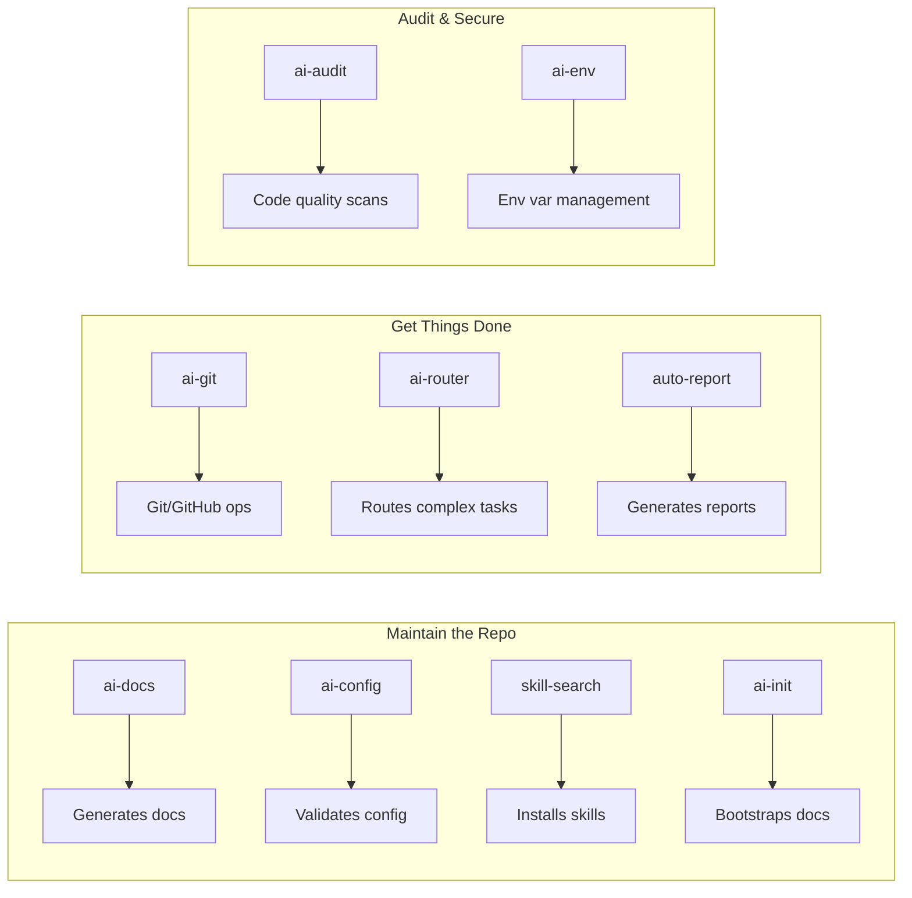
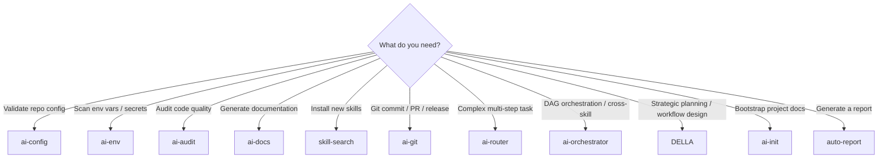
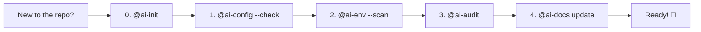

# Skill Index

Welcome to the myAI-Skills documentation — 10 OpenCode skills for AI-assisted development. Each skill is a self-contained agent that you invoke via `@trigger` commands.

> [!TIP]
> Looking for the **standalone agents**? See the [Agent Index](agents/README.md) to install `ROUTER`, `ORCHESTRATOR`, or `DELLA`.

## ⭐ Featured — Orchestration, Routing & Planning

The three flagship agents that coordinate and plan multi-step work across all skills:

| Agent | File | Engine | Best for | Install |
|-------|------|--------|----------|---------|
| **DELLA** | `agent/DELLA.md` | Discover → Examine → Link → Layout → Assess | Strategic planning, workflow composition, capability discovery | `copy agent\DELLA.md %USERPROFILE%\.config\opencode\agents\` |
| **ROUTER** | `agent/ROUTER.md` | Fixed 3-mode pipeline (planner → executor → reviewer) | Complex multi-step tasks with review loops | `copy agent\ROUTER.md %USERPROFILE%\.config\opencode\agents\` |
| **ORCHESTRATOR** | `agent/ORCHESTRATOR.md` | DAG engine (8-state FSM, cascade, deadlock detection) | Dependency-aware plans, parallel execution, cross-skill routing | `copy agent\ORCHESTRATOR.md %USERPROFILE%\.config\opencode\agents\` |

ROUTER and ORCHESTRATOR are also available as `@ai-router` / `@ai-orchestrator` triggers after setup with `--init`.

## Ecosystem Overview

> See the full [Skill Ecosystem Diagram](diagrams/skill-ecosystem.md) with cross-skill relationships.

## Skills by Category

### 📋 Meta — Maintain the Repository

| Skill | Trigger | What it does |
| :--- | :--- | :--- |
| [ai-docs](skills/ai-docs.md) | `@ai-docs` | Generates, updates, and audits Markdown documentation. 5 modes: generate, pro deep-dive, incremental update, compliance audit, interaction logging. |
| [ai-config](skills/ai-config.md) | `@ai-config` | Validates skill frontmatter, opencode.jsonc structure, and .gitignore coverage. Catches broken triggers and missing paths. |
| [ai-init](skills/ai-init.md) | `@ai-init` | Bootstraps project documentation in < 5 minutes. Auto-detects stack and tooling, generates ARCHITECTURE.md, CONVENTIONS.md, DECISIONS.md, ERRORS.md, and updates AGENTS.md. |
| [ai-orchestrator](skills/ai-orchestrator.md) | `@ai-orchestrator` | DAG-based task orchestrator with dynamic classification, capability registry, 8-state FSM, cascade failure handling, and deadlock detection. For complex multi-step work. |
| [skill-search](skills/skill-search.md) | `@skill-search` | Browse, install, and update skills from the Echeq/myAI-Skills GitHub repository. Acts as a package manager for OpenCode skills. |

### ⚡ Workflow — Get Things Done

| Skill | Trigger | What it does |
| :--- | :--- | :--- |
| [ai-git](skills/ai-git.md) | `@ai-git` | Git/GitHub hub with 4 sub-modules: commit, release, branch, PR. Each loads independently to save tokens. |
| [ai-router](skills/ai-router.md) | `@ai-router` | Routes complex tasks through a planner → executor → reviewer pipeline with severity-based fix retry (minor→flash, major→pro). |
| [auto-report](skills/auto-report.md) | `@auto-report` | Interactive 8-step wizard for generating reports in 5 formats. Adapts sections to subject. |

### 🛡️ Audit & Quality — Keep Code Healthy

| Skill | Trigger | What it does |
| :--- | :--- | :--- |
| [ai-audit](skills/ai-audit.md) | `@ai-audit` | Pattern-based code quality auditor across 5 weighted categories (Security 35%, Performance 20%, Maintainability 20%, Best Practices 15%, Documentation 10%). Grades A–D with regression tracking. |
| [ai-env](skills/ai-env.md) | `@ai-env` | Full environment lifecycle: scan for env vars, generate .env.example, update .gitignore, validate against .env, audit for hardcoded secrets. |

## Choosing the Right Skill

## Quick Start — Recommended Path

## Guides & Reference

| Guide | Description |
| :--- | :--- |
| [Usage Guide](guides/usage.md) | How to use and chain skills |
| [Creating Skills](guides/creating-skills.md) | How to create new skills with diagrams and validation checklist |
| [Agents Guide](guides/agents.md) | Install and set up ROUTER, ORCHESTRATOR, and DELLA standalone agents |
| [Agent Index](agents/README.md) | Full documentation for all standalone agents |
| [Conventions](reference/conventions.md) | Naming, frontmatter, diagram standards |
| [Architecture](reference/ARCHITECTURE.md) | ADRs, complexity analysis, dependency graph |

---

**[⬆ Back to Top](#)** | **[📂 Skill Index](/docs/README.md)**

<!-- Last updated: 2026-07-10 via @ai-docs update -->
