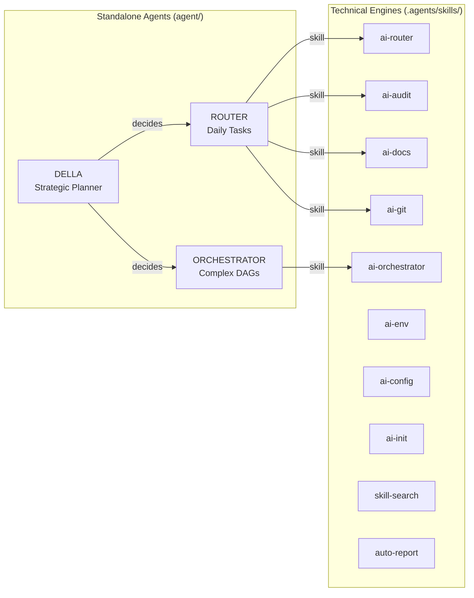

# Welcome to myAI-Skills

> A collection of **10 OpenCode skills** for AI-assisted development. Each skill is a self-contained agent invoked via `@trigger` commands.

[📂 Skill Index](/docs/README.md) • [📂 Agents](/docs/agents/README.md) • [📂 Guides](/docs/guides/usage.md) • [📂 Reference](/docs/reference/conventions.md)

---

## Quick Start — New Here?

| Step | What to do | How |
|:-----|:-----------|:----|
| 1 | Browse available skills | `@skill-search --list` or visit the [Skill Index](/docs/README.md) |
| 2 | Validate repo config | `@ai-config --check` |
| 3 | Scan for env vars | `@ai-env --scan` |
| 4 | Audit code quality | `@ai-audit` |
| 5 | Generate documentation | `@ai-docs` |

---

## Documentation Map

| Section | What you'll find | Start here |
|:--------|:-----------------|:-----------|
| **Skill Index** | All 10 skills listed by category with triggers and descriptions | [📂 Index](/docs/README.md) |
| **Agent Docs** | How to install and use ROUTER, ORCHESTRATOR, and DELLA standalone agents | [📂 Agents](/docs/agents/README.md) |
| **Usage Guide** | How to invoke, chain, and configure skills | [📂 Usage](/docs/guides/usage.md) |
| **Creating Skills** | How to create new skills with validation checklist | [📂 Create](/docs/guides/creating-skills.md) |
| **Conventions** | Naming, frontmatter, and diagram standards | [📂 Conventions](/docs/reference/conventions.md) |
| **Architecture** | ADRs, complexity analysis, and dependency graphs | [📂 Architecture](/docs/reference/ARCHITECTURE.md) |

---

## Skills at a Glance

| If you want to... | Use this |
|:------------------|:---------|
| Generate or update documentation | `@ai-docs` |
| Audit code for security and quality issues | `@ai-audit` |
| Validate configuration and frontmatter | `@ai-config --check` |
| Scan and manage environment variables | `@ai-env --scan` |
| Commit, branch, release, or create PRs | `@ai-git` |
| Bootstrap project documentation | `@ai-init` |
| Route complex multi-step tasks | `@ai-router` |
| Orchestrate cross-skill DAG workflows | `@ai-orchestrator` |
| Generate a formatted report | `@auto-report` |
| Install or update skills from GitHub | `@skill-search` |

---

## Architecture Overview

---

## Need Help?

- **I'm lost** → Start at the [Skill Index](/docs/README.md)

> [!TIP]
> Bookmark the [Skill Index](/docs/README.md) — it's the central hub for all documentation.
- **I need a plan** → Consult [DELLA](/docs/agents/DELLA.md)
- **I want to install skills** → `@skill-search --list`
- **I want to create a skill** → Read the [Creating Skills guide](/docs/guides/creating-skills.md)

---

> **Last updated:** 2026-07-10
