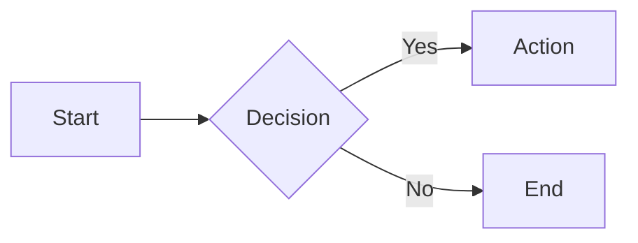
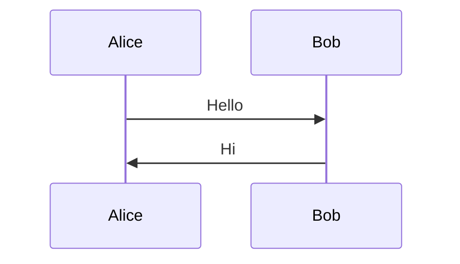
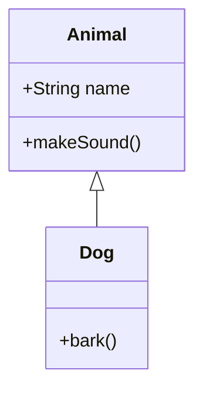

# Diagram Conventions

## Recommended `%%{init}%%` Directive

Place this at the **very top** of every Mermaid fenced code block, before any diagram content:

```yaml
%%{init: { 'flowchart': { 'useMaxWidth': true }, 'themeCSS': '.mermaid svg { max-width: 100% !important; height: auto !important; }' } }%%
```

This directive constrains diagram rendering so it never exceeds the container width and maintains proper aspect ratio.

## Examples

### Flowchart



### Sequence Diagram



### Class Diagram



## Rule

> The `%%{init}%%` directive **must** be the first line of every Mermaid fenced code block. Without it, diagrams may render oversized or overflow their container.

---

**[⬆ Back to Top](#)** | **[📂 Skill Index](/docs/README.md)**
