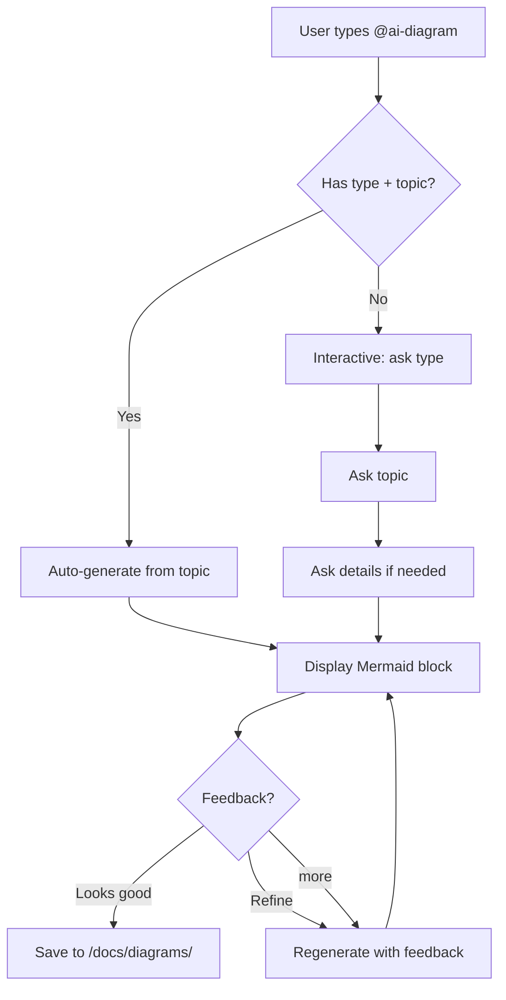

# ai-diagram flow

```mermaid
flowchart TD
  A[User types @ai-diagram] --> B{Has type + topic?}
  B -->|Yes| C[Auto-generate from topic]
  B -->|No| D[Interactive: ask type]
  D --> E[Ask topic]
  E --> F[Ask details if needed]
  C --> G[Display Mermaid block]
  F --> G
  G --> H{Feedback?}
  H -->|Looks good| I[Save to /docs/diagrams/]
  H -->|Refine| J[Regenerate with feedback]
  J --> G
  H -->|more| J
```
