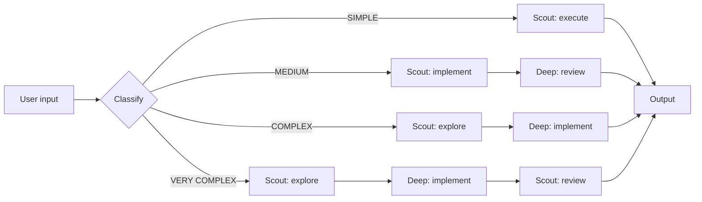

# ai-orchestrator 4-tier pipeline

```mermaid
flowchart LR
  A[User input] --> B{Classify}
  B -->|SIMPLE| C[Scout: execute]
  B -->|MEDIUM| D[Scout: implement]
  D --> E[Deep: review]
  B -->|COMPLEX| F[Scout: explore]
  F --> G[Deep: implement]
  B -->|VERY COMPLEX| H[Scout: explore]
  H --> I[Deep: implement]
  I --> J[Scout: review]
  C --> K[Output]
  E --> K
  G --> K
  J --> K
```
