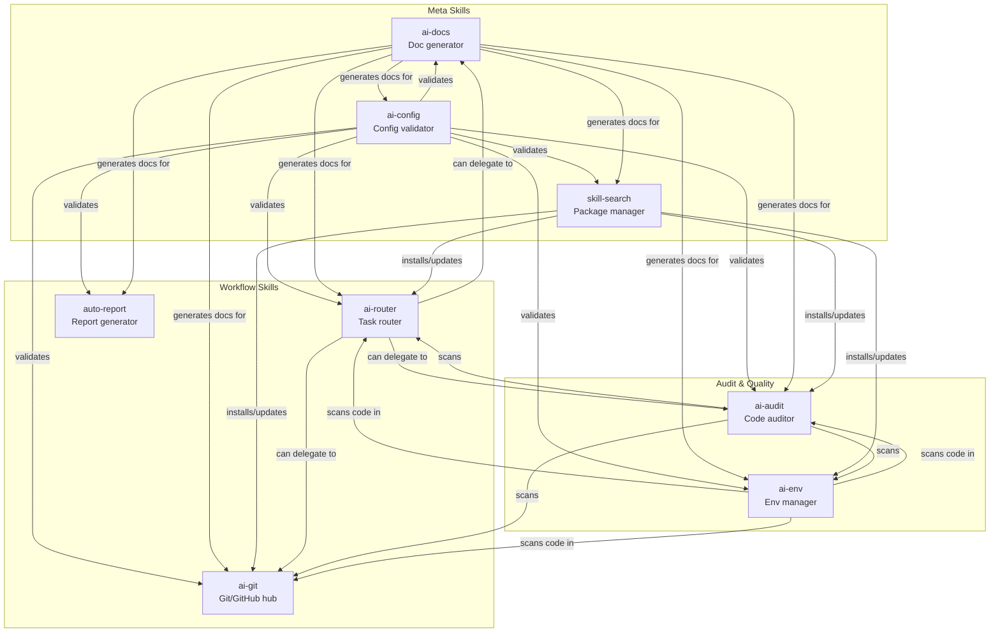

# Skill Ecosystem

How the 8 skills relate to each other and the repository structure.



## Skill Categories

| Category | Skills | Purpose |
| :--- | :--- | :--- |
| **Meta** | `ai-docs`, `ai-config`, `skill-search` | Maintain the repository itself — docs, config validation, package management |
| **Workflow** | `ai-git`, `ai-router`, `auto-report` | Get things done — version control, task routing, report generation |
| **Audit & Quality** | `ai-audit`, `ai-env` | Keep code healthy — quality auditing, environment management |

## Typical Workflows

### New to the repo
```
@ai-config --check → @ai-env --scan → @ai-audit → @ai-docs update
```

### Building a feature
```
@ai-router plan → implement → @ai-git --commit → @ai-git --pr
```

### Generating a report
```
@auto-report → @ai-docs pro <dir> → embed diagrams → export
```

---

**[⬆ Back to Top](#)** | **[📂 Skill Index](/docs/README.md)**

<!-- Last updated: 2026-07-07 via @ai-docs update -->
