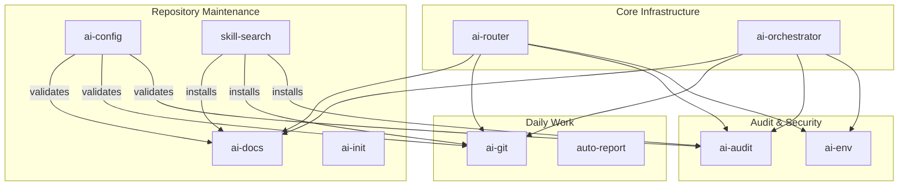

# Skill Ecosystem

> Relationship diagram showing how skills interact with each other.

[📂 Skill Index](/docs/README.md) • [📂 Diagrams](README.md)

---

---

> [!TIP]
> This diagram shows the cross-skill relationships. Skills in the Core and Meta groups maintain the repository; Workflow and Security skills are used in daily operations.

[⬆ Back to Top](#) | [📂 Skill Index](/docs/README.md)
