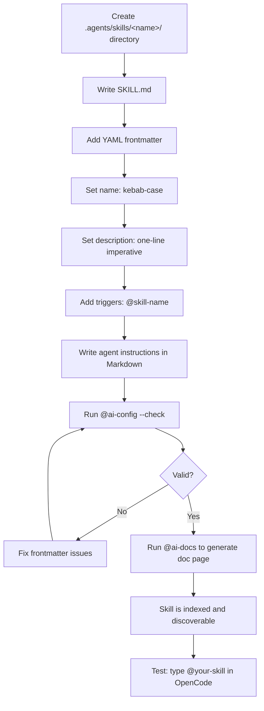

# Creating Skills

Guide to creating a new OpenCode skill in this repository.

## Why Prose-Only?

Skills in this repo are plain Markdown files with YAML frontmatter — no executable code, no build steps, no package managers. This design choice has three benefits:

- **Zero friction** — Write instructions, not code. No TypeScript compilation, no dependency resolution, no CI pipelines.
- **Token-efficient** — The agent reads only what it needs. A 50-line SKILL.md loads instantly and costs pennies.
- **Version-controllable** — Every change is a readable diff, unlike compiled or binary formats.

## Creation Flow



## Skill Design Pattern

Skills follow a standard format defined at [agentskills.io](https://agentskills.io) and supported by 40+ AI tools including OpenCode, Claude Code, Codex, Cursor, and Windsurf.

```
my-skill/
├── SKILL.md       # required: name, description, instructions
├── scripts/       # optional: executable code
├── references/    # optional: docs and specs
└── assets/        # optional: templates and data
```

Hubs like `ai-git` and `ai-router` use sub-modules in the same directory for token efficiency: the main `SKILL.md` routes to specialized `.md` files, so only the needed instructions are loaded.

## Installation Paths

Skills can be installed in any of these locations. The tool checks them in order — project paths override global ones.

### OpenCode

| Scope | Path |
| :--- | :--- |
| Project | `.opencode/skills/<name>/SKILL.md` |
| Global | `~/.config/opencode/skills/<name>/SKILL.md` |

### Claude Code (compatible)

| Scope | Path |
| :--- | :--- |
| Project | `.claude/skills/<name>/SKILL.md` |
| Global | `~/.claude/skills/<name>/SKILL.md` |

### Agent (compatible)

| Scope | Path |
| :--- | :--- |
| Project | `.agents/skills/<name>/SKILL.md` |
| Global | `~/.agents/skills/<name>/SKILL.md` |

Skills are loaded at tool startup. Only the `name` and `description` are read initially — the full instructions load on demand when a skill's description matches your request. This keeps startup fast and token-efficient.

## SKILL.md Anatomy

### Frontmatter

YAML between `---` markers that defines the skill's identity:

```yaml
---
name: my-skill
description: What this skill does in one line
triggers:
  - "@my-skill"
  - "@my-skill --flag"
allowed-tools: Read, Write, Bash, Glob, Grep
---
```

| Field | Required | Why |
| :--- | :--- | :--- |
| `name` | Yes | Kebab-case identifier. Must be unique across all skills. Used as the directory name. |
| `description` | Yes | One-liner shown in `@skill-search --list` and the doc index. Imperative tone preferred. |
| `triggers` | Recommended | List of `@trigger` strings. First one is the primary trigger. Must be unique — ambiguous triggers break routing. |
| `allowed-tools` | Optional | Comma-separated tools the agent may use. If omitted, OpenCode's default permissions apply. |

### Instructions

After the frontmatter, write Markdown instructions for the agent. Start with a clear role definition:

```markdown
# ROLE: MySkillName

Do X, Y, and Z. Follow these rules:
```

### When to Use Sub-Modules

If your skill has multiple distinct commands (like `ai-git` with `--commit`, `--branch`, `--pr`), split them into separate `.md` files in the same directory:

```
.agents/skills/ai-git/
├── SKILL.md          # Router: loads sub-module by flag
├── commit.md         # @ai-git --commit
├── branch.md         # @ai-git --branch
├── pr.md             # @ai-git --pr
└── release.md        # @ai-git --release
```

This saves tokens: the agent only reads the sub-module for the flag you used, not the entire skill.

## Validation Checklist

Before submitting a new skill:

- [ ] `name` is kebab-case and matches the directory name
- [ ] `description` is a single imperative sentence
- [ ] At least one trigger with `@` prefix
- [ ] No trigger conflicts with existing skills
- [ ] Instructions are in professional English
- [ ] `@ai-config --check` passes
- [ ] `@ai-docs` generates the skill's doc page

> [!TIP]
> Look at existing skills for reference. `skill-search` is a good minimal example (single switchable commands). `ai-router` shows a complex pipeline with sub-modules and references.
>
> After creating your skill, run `@skill-search --list` to verify it appears in the index.

---

**[⬆ Back to Top](#)** | **[📂 Skill Index](/docs/README.md)**
