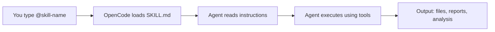
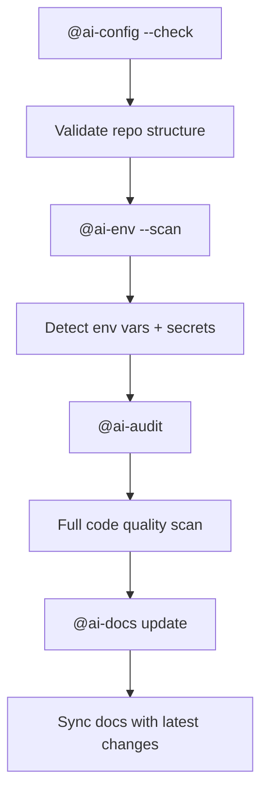

# Usage

Skills are OpenCode agents invoked via `@trigger` commands in your AI assistant. No installation, no imports, no package managers.

## How Skills Work

Each skill is a `.md` file with YAML frontmatter. When you use a trigger like `@ai-audit`, OpenCode loads that skill's instructions into the agent's context, and the agent follows them to perform the task.

## Using a Skill

1. **Discover** — Run `@skill-search --list` to see all available skills, or check the [Skill Index](/docs/README.md)
2. **Trigger** — Type `@skill-name` followed by optional flags or parameters:
   - `@ai-audit` — interactive audit
   - `@ai-git --commit` — staged commit
   - `@ai-docs update ai-audit` — update one doc page
3. **Follow the flow** — The skill guides you step by step or executes autonomously depending on the mode

## Chaining Skills

Skills can be chained for powerful workflows:

## Installing Skills from GitHub

Use `@skill-search` to install skills from the [Echeq/myAI-Skills](https://github.com/Echeq/myAI-Skills) repository:

| Command | Action |
| :--- | :--- |
| `@skill-search --list` | List all available remote skills |
| `@skill-search --search <query>` | Search by name or keyword |
| `@skill-search --install <name>` | Download skill to `.agents/skills/<name>/` |
| `@skill-search --update <name>` | Re-download and overwrite an installed skill |

After installing, run `@ai-docs` to regenerate the documentation index.

## Configuration

Skills define their own configuration in their SKILL.md file. They do not read environment variables or global config. Each skill's doc page documents any parameters, outputs, or notable behavior.

---

**[⬆ Back to Top](#)** | **[📂 Skill Index](/docs/README.md)**
