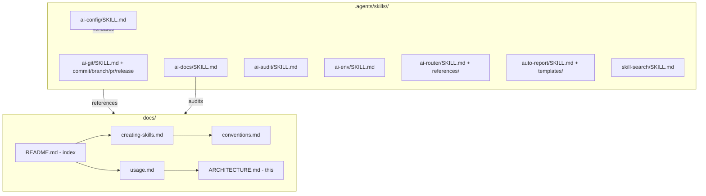

# Documentation Architecture

> Professional deep-dive into the docs system of myAI-Skills.

## ADR-001: Documentation as a Self-Healing System

**Status:** Adopted 2026-06-23

**Context:** The repo contains 8 OpenCode skills (plain `.md` files) with zero runtime code. Traditional doc generation from source (TSDocs, JSDoc) is inapplicable. Documentation must be authored manually but remain verifiable.

**Decision:** Implement a dual-layer documentation model:

| Layer | Location | Ownership | Mutation Policy |
|-------|----------|-----------|----------------|
| Skill definitions | `.agents/skills/<name>/SKILL.md` | Skill author | Manual |
| Global docs | `docs/` | `@ai-docs` agent | Semi-automated audit |

Cross-references flow one way: skill definitions are the source of truth; `docs/` summarizes and indexes but never duplicates.

**Consequences:**
- Positive: No doc generation pipeline to maintain
- Positive: Audit mode (`@ai-docs audit`) enforces compliance without a build step
- Negative: No automated guard against docs/skill drift; relies entirely on triggered audits

---

## Complexity Analysis

### ai-docs State Machine

The `ai-docs` skill implements a 5-mode deterministic state machine:

```mermaid
%%{init: { 'flowchart': { 'useMaxWidth': true }, 'themeCSS': '.mermaid svg { max-width: 100% !important; height: auto !important; }' } }%%
stateDiagram-v2
    [*] --> Standard : @ai-docs
    [*] --> Professional : @ai-docs pro <dir>
    [*] --> Update : @ai-docs update <name>
    [*] --> Audit : @ai-docs audit
    [*] --> Log : @ai-docs --log

    Standard --> GenerateIndex : Glob .agents/skills/*/SKILL.md
    GenerateIndex --> GeneratePages : Per-skill template
    GeneratePages --> [*]

    Professional --> DeepDive : Read dir files
    DeepDive --> AddADR : Why this approach
    AddADR --> AddComplexity : Big-O analysis
    AddComplexity --> AddDeps : Mermaid dependency graph
    AddDeps --> AddEdgeCases : Concurrency + failure modes
    AddEdgeCases --> [*]

    Update --> CompareSources : Diff SKILL.md vs docs page
    CompareSources --> PreserveManual : Keep &lt;!-- MANUAL --&gt; blocks
    PreserveManual --> SyncMissing : Update only stale sections
    SyncMissing --> [*]

    Audit --> CheckCritical : 40% weight
    CheckCritical --> CheckWarning : 30% weight
    CheckWarning --> CheckSuggestion : 30% weight
    CheckSuggestion --> Score : PASS if ≥ 80%
    Score --> [*]

    Log --> ReadLogModule : Load log.md sub-module
    ReadLogModule --> WriteLog : Write to docs/log/AI-LOG-*.md
    WriteLog --> [*]
```

**Time Complexity (per mode):**
- STANDARD: O(n) where n = total non-git files
- PROFESSIONAL: O(k) where k = targeted module depth
- UPDATE: O(m) where m = files with stale timestamps
- AUDIT: O(n) scan + O(p) report generation (p = severity categories)
- LOG: O(1) — single file read + single file write

**Space Complexity:** O(d) where d = document count. No intermediate representation is materialized.

---

## Dependency Graph



**External dependencies:** None. The entire system is self-contained within the repo.

---

## Stress / Edge Cases

### Doc-Skill Drift
A skill's `SKILL.md` is updated but `docs/` is not. Mitigation: `@ai-docs audit` flags uncovered code (Critical). `@ai-docs update` reconciles timestamps.

### Zero-Code Skills
All 9 skills are prose-only `.md` files with YAML frontmatter. No runtime code, no `src/`, no `tests/`, no `package.json`. Risk: contributors from traditional software backgrounds may expect executable packages.

### Cross-Link Rot
Hardcoded relative paths (`../.agents/skills/`). If the repo is consumed as a submodule, paths break. Current resolution: document path assumption in `docs/ARCHITECTURE.md`.

### Audit False Positives
The audit checklist expects `/docs/api/`, `/docs/setup/`, etc. These do not apply to pure-skill repos. Resolution: audit standards should be relaxed from a mandatory folder list to "organize as the project grows."

---

**[⬆ Back to Top](#)** | **[📂 Skill Index](/docs/README.md)**

<!-- Last updated: 2026-07-07 via @ai-docs update -->
