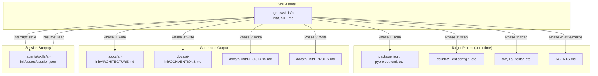

# AI Init — Deep-Dive Architecture

> Generated by `@ai-docs pro ai-init` on 2026-07-10.
> Source: `.agents/skills/ai-init/SKILL.md`

---

## ADR-001: Prose-Only Skill — No Runtime Code

**Status:** Adopted 2026-07-10

**Context:** The `@ai-init` skill must detect project structure, ask interactive questions, and generate Markdown files. In many ecosystems, this would be implemented as a CLI tool in Python, Node.js, or Go — reading filesystem state, running an interactive REPL, and writing output files.

**Decision:** Implement as a prose-only Markdown skill with zero runtime code. All logic (scanning, questioning, generating, validating) is encoded as step-by-step instructions the agent follows interpretively.

**Alternatives considered:**

| Alternative | Why discarded |
|---|---|
| Python CLI (`argparse` + `inquirer`) | Adds a dependency requirement; breaks the "no runtime" contract of this skill repo; harder to audit |
| Node.js CLI with `commander` + `inquirer` | Same as Python, plus requires Node runtime; not suitable for this Markdown-first repo |
| Hybrid (SKILL.md + companion script) | Possible but increases complexity; `auto-report` tries this pattern but still relies on agent interpretation |

**Consequences:**
- Positive: Zero installation — the skill works in any OpenCode session immediately
- Positive: Fully auditable — every instruction is visible in SKILL.md
- Positive: No version drift between skill and runtime
- Negative: Relies on the LLM agent's ability to follow instructions faithfully (no hard enforcement of phases or validation rules)
- Negative: No automated test coverage for the skill logic

---

## ADR-002: Interactive Wizard via Conversational State

**Status:** Adopted 2026-07-10

**Context:** The skill needs to ask 3–5 questions, collect answers, and use them to generate files. The challenge is maintaining conversational state across multiple turns without a formal state machine.

**Decision:** Use the LLM's conversational context as the state store. Questions are asked one at a time, and the agent accumulates answers in its own working memory. As a fallback for interruptions, partial answers are saved to `.agents/skills/ai-init/assets/session.json`.

**Alternatives considered:**

| Alternative | Why discarded |
|---|---|
| YAML frontmatter with all questions up front | Loses interactivity — users can't correct or elaborate mid-flow |
| Multi-turn form with structured output | Over-engineered for 3–5 questions; the conversational approach is simpler and more natural |
| External config file read at startup | Adds a dependency on file I/O before the wizard even starts |

**Consequences:**
- Positive: Natural interaction — one question at a time, with examples and explanations
- Positive: Session resume via JSON file covers the main failure mode (interrupted session)
- Negative: If the LLM loses context mid-wizard, data may be lost without the session fallback
- Negative: Hard to parallelize or pause/resume programmatically

---

## ADR-003: Four-File Output Structure

**Status:** Adopted 2026-07-10

**Context:** The generated documentation must be comprehensive enough to be useful, but structured enough to be maintainable. A single monolithic document would be hard to navigate and update.

**Decision:** Split output into 4 focused files under `/docs/ai-init/`:

| File | Focus | Update cadence |
|---|---|---|
| `ARCHITECTURE.md` | What the system is and how it works | Per feature / stack change |
| `CONVENTIONS.md` | How the team writes code | Per tooling / style decision |
| `DECISIONS.md` | Why decisions were made | Per architectural decision |
| `ERRORS.md` | Known issues and their fixes | Per resolved incident |

**Alternatives considered:**

| Alternative | Why discarded |
|---|---|
| Single `README.md` | Becomes unmanageable as the project grows; no separation of concerns |
| Two files: `ARCHITECTURE.md` + `CONVENTIONS.md` | Missing explicit decision tracking and error documentation |
| Wiki / Notion external | Not co-located with code; goes stale faster; not reproducible via `@ai-init` |

**Consequences:**
- Positive: Each file has a clear, narrow purpose — easy to update independently
- Positive: `DECISIONS.md` acts as an architectural decision log (ADR-lite)
- Positive: `ERRORS.md` serves as a team knowledge base for recurring issues
- Negative: Four files means four places to check when onboarding; mitigated by AGENTS.md index block

---

## Complexity Analysis

### Execution Complexity (per mode)

| Mode | Time Complexity | Space Complexity |
|---|---|---|
| Full wizard (`@ai-init`) | O(S + T + Q + G) where:<br>S = patterns scanned (stack detection)<br>T = tooling configs checked<br>Q = questions asked (≤5)<br>G = files generated (4) | O(V) where V = accumulated answers + 4 generated files in memory |
| Validate (`@ai-init validate`) | O(S' + D + C + E) where:<br>S' = current structure scan<br>D = dependency manifest scan<br>C = config file comparison<br>E = DECISIONS.md staleness check | O(1) — report only, no file generation |
| `--types`/`--features`/`--screaming` | Same as full wizard minus 1 question | Same as full wizard |

**Worst-case scenario:** Full wizard on a large monorepo with 500+ top-level files — stack detection scans all manifests (O(N) where N = file count), but in practice S, T, and structure checks are bounded by the number of known patterns (≈ 20 stack patterns, ≈ 15 tooling patterns, ≈ 10 structure patterns). So effective complexity is **O(1)** — the agent scans a fixed set of known files.

### I/O Complexity

| Operation | I/O cost |
|---|---|
| Read manifest files | Small — typically 1–3 files, each < 50 KB |
| Read config files | Small — typically 1–5 files, each < 20 KB |
| Write 4 generated files | Small — each < 5 KB |
| Write session.json | Tiny — < 1 KB |
| Read/write AGENTS.md | Tiny — < 2 KB |

**Total I/O:** < 100 KB across the entire wizard. No performance concerns.

### State Complexity

The skill maintains a **linear accumulation** of answers — no nested state transitions, no branching logic beyond the 3 structure-flags. The state machine is a simple sequential flow:

```
start → detect → confirm → ask_struct → ask_dataflow → ask_patterns → ask_restrictions → ask_conventions → generate → update_agents → done
```

Each arrow is a deterministic transition. The only branching is:
- Flag provided? → skip structure question or not
- Auto-detected? → confirm or ask
- AGENTS.md exists? → merge or create
- `/docs/ai-init/` exists? → overwrite, merge, or abort

**Cyclomatic complexity:** 4 (3 flags + 1 existing-dir check) — very low.

---

## Dependency Graph



### External Dependencies

| Dependency | Type | Required? | Notes |
|---|---|---|---|
| Target project manifests | Runtime input | Yes | Must exist or skill treats as greenfield |
| Filesystem read access | Platform | Yes | The agent must `glob`/`grep`/`read` project files |
| Filesystem write access | Platform | Yes | The agent must `write` output files |
| PowerShell (Windows) | Platform | Conditional | Used for `mkdir` on Windows |
| sh (macOS/Linux) | Platform | Conditional | Used for `mkdir -p` on Unix |
| `@ai-config` skill | Optional validation | No | Used for `--check` post-creation validation |
| `@ai-docs` skill | Optional documentation | No | Used for doc page generation |

**No runtime libraries are imported or required.** The skill operates entirely through the agent's built-in tools (`read`, `write`, `glob`, `grep`, `bash`).

---

## Stress / Edge Cases

### 1. Giant Monorepo (10,000+ files)

**Problem:** Scanning all files in Phase 1 would be prohibitively slow if the agent naively iterates every file.

**Mitigation:** The detection rules target **specific known filenames and top-level directories** only. The agent should `glob` for specific patterns (`**/package.json`, `**/requirements.txt`, etc.) rather than enumerating all files. Top-level directories are checked by name, not by traversing contents.

**Residual risk:** If a monorepo has 50+ `package.json` files, the agent may spend significant time reading them. The instruction limits structure detection to top-level directories (+ one level peek into `src/`).

### 2. Non-ASCII Project Names

**Problem:** The project name is inferred from `package.json` `name` field or directory name. Non-ASCII or emoji names could cause encoding issues in generated Markdown.

**Mitigation:** The name is used only as a heading in generated files. Markdown handles Unicode natively. No encoding transformation is applied, so the name passes through verbatim.

### 3. Binary Files Mistaken for Manifests

**Problem:** The skill scans for specific file patterns. A `*.csproj` match is unlikely to be a binary file (it's XML), but a user could have a non-standard binary file matching one of the patterns.

**Mitigation:** The agent reads the first few bytes of each manifest to confirm it's text. If `read` returns a binary/encoding error, skip that file and note it in the summary.

### 4. Mid-Wizard Interruption (Context Loss)

**Problem:** The LLM loses conversation context (session timeout, browser close, network error) after collecting partial answers.

**Mitigation:** Session save to `.agents/skills/ai-init/assets/session.json` after every answer. On next invocation, the agent checks for this file and offers to resume.

**Limitation:** The session file stores the raw text answers but not the agent's internal state (which flags were provided, which questions were skipped). The resume process re-derives this from the answers + existing file state.

### 5. Conflicting Flags (`@ai-init --types --features`)

**Problem:** The user provides mutually exclusive structure flags.

**Handling:** Last flag wins with a warning. The SKILL.md explicitly documents this behavior: "Multiple structure flags provided; using --features."

### 6. Generated Docs Become Stale

**Problem:** After initial generation, the project evolves but `/docs/ai-init/` isn't updated. The `@ai-init validate` command is the primary defense.

**Risk level:** Medium-high. Validation is reactive (triggered by the user), not proactive. Team discipline is required to keep docs current.

**Mitigation:** The `--fix` sub-flag after validation re-runs the wizard with existing answers as defaults, making it easy to update only the drifted sections.

### 7. GitIgnored AGENTS.md

**Problem:** In this repo, `AGENTS.md` is gitignored. The skill creates/updates it but the change won't be tracked by version control unless the user explicitly adds it.

**Handling:** The skill prints a reminder: "AGENTS.md is gitignored by default. To commit it: `git add -f AGENTS.md`."

### 8. Concurrent Skill Invocations

**Problem:** If the user runs `@ai-init` in two parallel sessions, both may read/write `session.json` simultaneously.

**Risk level:** Low. The skill is invoked by a single agent at a time. OpenCode doesn't parallelize skill invocations on the same project. The session file is a simple atomic write.

---

**[⬆ Back to Top](#)** | **[📂 Skill Index](/docs/README.md)**

<!-- Last updated: 2026-07-10 via @ai-docs pro ai-init -->
