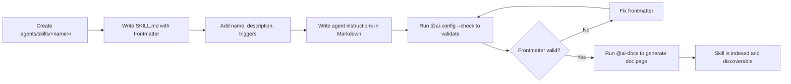

# Conventions

[📂 Welcome](/docs/WELCOME.md) • [📂 Skill Index](/docs/README.md) • [📂 Guides](/docs/guides/creating-skills.md)

---

## Skill Structure

Every skill lives in `.agents/skills/<name>/` and consists of a single `SKILL.md` file with YAML frontmatter. No runtime code, no `src/`, no `package.json`.

```
.agents/skills/<name>/
├── SKILL.md          # YAML frontmatter + Markdown instructions
└── ...               # Optional sub-modules (ai-git hub, ai-router references/)
```

## Frontmatter Rules

| Field | Rule | Example |
|:------|:-----|:--------|
| `name` | kebab-case, lowercase | `ai-git`, `auto-report` |
| `description` | One line, imperative tone | "Generates and audits Markdown documentation" |
| `triggers` | `@skill-name` with `@` prefix, kebab-case | `@ai-docs`, `@ai-git --commit` |
| `allowed-tools` | Comma-separated tool names | `Read, Write, Bash, Glob, Grep` |

## Trigger Convention

- All triggers use `@` prefix: `@ai-audit`, `@ai-env --scan`
- Flags use `--` prefix: `--full`, `--fix`, `--list`
- Trigger naming is kebab-case: `skill-search`, not `skillSearch` or `skill_search`
- Each trigger must be unique across all skills (ambiguous routing breaks the skill system)

## Diagram Standards

All generated Mermaid diagrams must include a `%%{init}%%` block constraining max-width and font size. See [Diagram Conventions](/docs/diagrams/README.md) for the exact directive pattern.

Place the directive as the **first line** of every Mermaid fenced code block, before any diagram content.

## Skill Creation Lifecycle



## Language

All instructions, comments, and documentation must be in professional English.

## Agent Setup

The file `agent/ROUTER.md` defines a standalone adaptive orchestrator agent. It should be installed to OpenCode's agent PATH so it's available as a subagent in other projects. Add it to your OpenCode configuration's agent paths or reference it via `{file:agent/ROUTER.md}` in `opencode.jsonc`.

## Documentation Standards for Agents

Every skill's documentation (`docs/skills/<name>.md`) must include:

| Required section | What to include |
|:-----------------|:----------------|
| **Summary card** | Trigger, allowed tools, and category at the top |
| **Quick Reference** | A table showing each mode/flag and what it does |
| **Overview** | 2-4 sentences: what the skill does, when to use it, key concepts |
| **Commands** | Complete table of all flags with descriptions |
| **Notes/Warnings** | At least one admonition (`> [!NOTE]`, `> [!WARNING]`, `> [!TIP]`) for edge cases, prerequisites, or important behavior |
| **Footer** | Links back to the Skill Index |

When creating or updating a skill:
1. Every trigger documented in `triggers` frontmatter must have a corresponding row in the Commands table
2. The primary trigger (first in the list) must have a dedicated Quick Reference entry
3. At least one working example should be described
4. If the skill has side effects or modifies files, document the output paths
5. If the skill has prerequisites (other skills, tools, config), document them in a `> [!WARNING]` admonition
6. Run `@ai-docs` after creating/editing to regenerate the doc page

> [!TIP]
> The autogenerated template in `@ai-docs` already handles most of these requirements. If you add a new skill, just run `@ai-docs` to generate its doc page automatically.

---

[⬆ Back to Top](#) | [📂 Skill Index](/docs/README.md)
