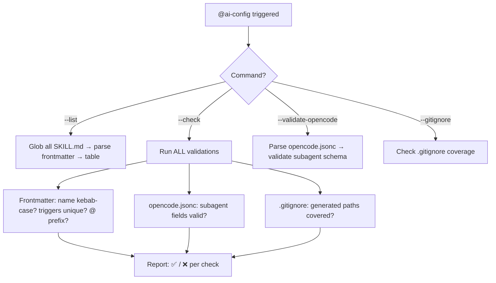

# ai-config

Configuration manager for this repo. Reads and validates opencode.jsonc, skill frontmatter across .agents/skills/, and .gitignore consistency.

> **Trigger:** `@ai-config` | `@ai-config --list` | `@ai-config --check` | `@ai-config --validate-opencode` | `@ai-config --gitignore`

## Quick Start

1. Type `@ai-config --list` to see all skills with triggers
2. Type `@ai-config --check` to run all consistency checks
3. Type `@ai-config --validate-opencode` to validate subagent config

## Description

Manages and validates this repo's configuration files. Never edits code — only config manifests. Reads SKILL.md frontmatter from all skills, opencode.jsonc structure, and .gitignore coverage.

## Architecture

**Why three validation domains?** Each has different failure modes. A bad frontmatter breaks skill discovery. A malformed opencode.jsonc breaks subagent routing. A missing .gitignore entry leaks generated artifacts.

## Usage

| Command | Action |
| :--- | :--- |
| `@ai-config` | Interactive: choose mode from list |
| `@ai-config --list` | List all skills with name, description, triggers |
| `@ai-config --check` | Run all consistency checks (triggers, naming, .gitignore) |
| `@ai-config --validate-opencode` | Validate opencode.jsonc structure |
| `@ai-config --gitignore` | Check .gitignore for recommended entries |

## Configuration

Reads from:
- `.agents/skills/*/SKILL.md` — frontmatter inspection
- `opencode.jsonc` — subagent definitions
- `.gitignore` — ignore rule coverage

> [!NOTE]
> This skill validates but never edits configuration files unless explicitly asked. Run `@ai-config --check` periodically to catch drift.

---

<!-- Last updated: 2026-07-07 via @ai-docs update -->

**[⬆ Back to Top](#)** | **[📂 Skill Index](/docs/README.md)**
