# ai-git

Git/GitHub skill hub. Routes `--commit`, `--release`, `--branch`, and `--pr` to lightweight sub-skill files. Keeps each module small and token-efficient — only the requested module is loaded.

> **Trigger:** `@ai-git` | `@ai-git --commit` | `@ai-git --release` | `@ai-git --branch` | `@ai-git --pr`

## Quick Start

1. Type `@ai-git --commit` to stage and commit changes.
2. Type `@ai-git --release` to generate changelog, bump version, and create a GitHub release.
3. Type `@ai-git --branch` to create, switch, rename, or delete branches.
4. Type `@ai-git --pr` to create a GitHub PR from the current branch.
5. Type `@ai-git` (bare) to list available modules.

**Example:** `@ai-git --branch` → create a new branch `feature/xyz` from current HEAD.

## Description

A modular router for common Git and GitHub operations. Each sub-command (`--commit`, `--release`, `--branch`, `--pr`) loads its own instruction file from `.agents/skills/ai-git/`. This keeps the router lightweight and prevents token waste — only the module you actually use is read into context.

## Architecture

```mermaid
%%{init: { 'flowchart': { 'useMaxWidth': true }, 'themeCSS': '.mermaid svg { max-width: 100% !important; height: auto !important; }' } }%%
flowchart TD
    A["@ai-git triggered"] --> B{Flag?}
    B -->|bare| H[Show help + module list]
    B -->|--commit| C[Load commit.md]
    B -->|--release| D[Load release.md]
    B -->|--branch| E[Load branch.md]
    B -->|--pr| F[Load pr.md]
    C --> C1[Stage &#8594; conventional commit &#8594; push?]
    D --> D1[Changelog &#8594; SemVer bump &#8594; tag &#8594; GitHub release]
    E --> E1[Create / switch / rename / delete branch]
    F --> F1[Create PR from current branch &#8594; return URL]
    H & C1 & D1 & E1 & F1 --> Done
```

**Why a hub-and-spoke?** Each sub-command is a separate `.md` file that loads only when its flag is used. This saves tokens — the agent never reads `commit.md` when you only want `--branch`.

## Usage

| Command | Action |
| :--- | :--- |
| `@ai-git --commit` | Stage all changes and create a conventional commit |
| `@ai-git --release` | Changelog, SemVer bump, git tags, GitHub releases |
| `@ai-git --branch` | Create, switch, rename, delete branches |
| `@ai-git --pr` | Create GitHub PR from current branch (no auto-release) |
| `@ai-git` (bare) | Show help + list available modules |

## Configuration

No configuration needed. Relies on the repo's `.gitignore` for commit exclusions and `gh` CLI for PR/release operations.

> [!TIP]
> To add a new module: create `<name>.md` in `.agents/skills/ai-git/` and add the trigger to the SKILL.md frontmatter.

---

<!-- Last updated: 2026-07-07 via @ai-docs update -->

**[⬆ Back to Top](#)** | **[📂 Skill Index](/docs/README.md)**
