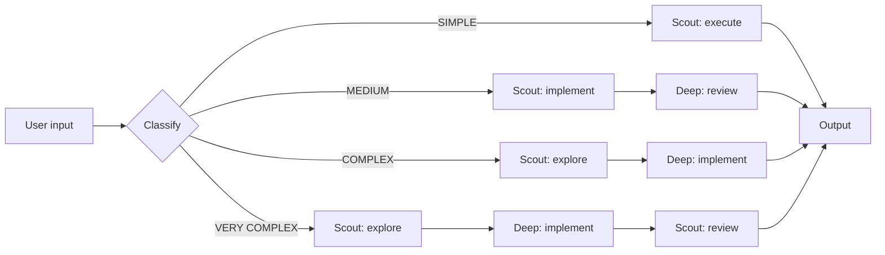

# ai-orchestrator

Intelligent task router with 4-tier auto-pipeline. Routes through Flash (cheap) and Deep Reasoner (powerful) subagents. Mandatory plan files.

> **Trigger:** `@ai-orchestrator` | `@ai-orchestrator --auto` | `@ai-orchestrator --quick` | `@ai-orchestrator --deep` | `@ai-orchestrator --thorough`

## Quick Start

**Full delegation:**
1. Type `@ai-orchestrator <task>` — auto-classifies, writes a PLAN file, routes to the right subagent(s), and executes.
2. Or force a tier: `--quick` (no plan, direct), `--deep` (Complex), `--thorough` (Very Complex).

**Example:** `@ai-orchestrator add validation to login form` → plan written → routed as MEDIUM → executed.

## Description

Routes requests through two subagents — `orchestrator-scout` (Flash, cheap) and `orchestrator-deep` (Reasoner, expensive) — based on task complexity. Every task (unless `--quick`) writes a PLAN file first to serve as external memory across turns.

### 4-Tier Auto-Classification

| Tier | Pipeline | Use for |
| :--- | :--- | :--- |
| SIMPLE | Scout → done | rename, typo, grep, list, trivial |
| MEDIUM | Scout implements → Deep reviews | feature, add, create, endpoint |
| COMPLEX | Scout explores → Deep implements | debug, refactor, optimize, cross-module |
| VERY COMPLEX | Scout → Deep → Scout reviews | migrate, redesign, rewrite, auth, security |

### Flags

| Flag | Action |
| :--- | :--- |
| `--quick` | SIMPLE, no plan file, no memory update |
| `--deep` | Force COMPLEX tier |
| `--thorough` | Force VERY COMPLEX tier |

### Plan File

Every `@ai-orchestrator` invocation writes a plan file (unless `--quick`). Plan files live in `.agents/plan/PLAN_{YYYYMMDD}_{HHmmss}.md` and contain: Objective, Files, Steps. After execution, the task is logged to `.agents/memory/index.md` (last 5 entries kept).

## Usage

| Command | Action |
| :--- | :--- |
| `@ai-orchestrator <task>` | Full delegation: classify, plan, execute, persist |
| `@ai-orchestrator --quick <task>` | SIMPLE, no plan, no memory |
| `@ai-orchestrator --deep <task>` | Force COMPLEX pipeline |
| `@ai-orchestrator --thorough <task>` | Force VERY COMPLEX pipeline |
| `@ai-orchestrator` | Interactive: ask → classify → execute |

## Configuration

Subagents defined in `opencode.jsonc`:
- `orchestrator-scout` — DeepSeek Flash, read-only + bash, no edits
- `orchestrator-deep` — DeepSeek Reasoner, full tool access

Memory and plan directories auto-created on first use.

> [!NOTE]
> Plan files are gitignored. They accumulate and serve as persistent context across sessions.

---

**[⬆ Back to Top](#)** | **[📂 Skill Index](/docs/README.md)**
