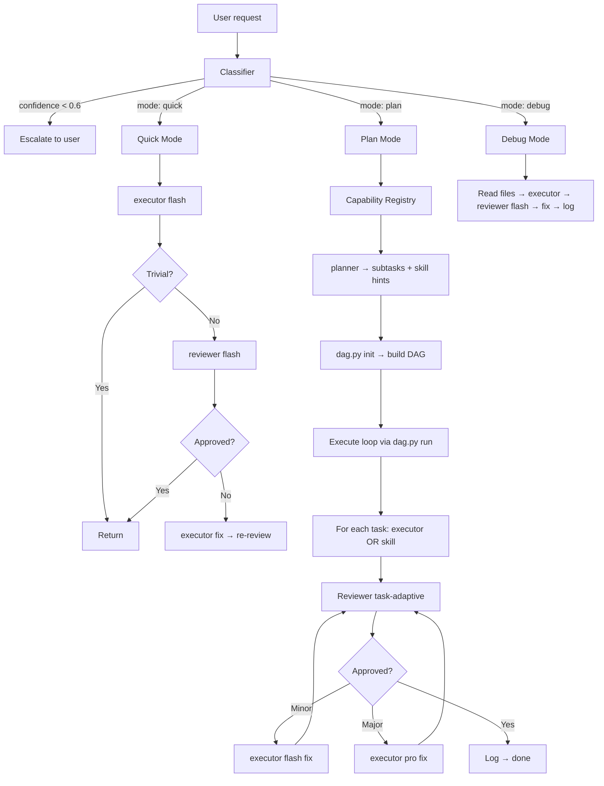

# ai-orchestrator

Intelligent task orchestrator. Classifies requests by intent, decomposes them into subtasks, routes each subtask to the best available agent or skill, and reviews results with task-adaptive criteria.

> **Trigger:** `@ai-orchestrator`

## Quick Start

1. Run `@ai-orchestrator --init` to configure models for planner, executor, and reviewer roles.
2. Type `@ai-orchestrator <task>` — the skill dynamically classifies the request into **quick**, **plan**, or **debug** mode.
3. For **plan** mode: decomposes into a formal DAG → delegates subtasks → reviews with task-adaptive criteria → fix loop on rejection.
4. For **quick** mode: delegates directly to executor; optionally reviewed.
5. For **debug** mode: reads files, delegates to executor, reviews, applies fix.

**Example:** `@ai-orchestrator audit this repo for security issues and generate a report` → classified as **plan** (confidence 0.9) → registry matches `ai-audit` (security) and `ai-docs` (documentation) → planner decomposes → DAG executes → review passes → logs to `history.md`.

## Description

Unlike `ai-router` (fixed 3-mode keyword pipeline), ai-orchestrator uses **dynamic classification** via a structured prompt that outputs `{mode, confidence, capabilities_needed, suggested_skills}`. A **capability registry** maps task requirements to installed skills, enabling automatic routing without hardcoded triggers.

The orchestrator builds a formal **Directed Acyclic Graph (DAG)** for plan-mode tasks, managed by a Python CLI engine (`dag.py`, stdlib only). Each subtask progresses through an 8-state machine (READY → RUNNING → BLOCKED → COMPLETED → FAILED → CANCELLED → SKIPPED → PAUSED) with deadlock detection and transitive cascade failure propagation.

## Architecture



### Dynamic Classification

| Condition | Mode |
|-----------|------|
| Confidence < 0.6 | Escalate to user |
| `error`/`fail`/`bug` in query (fallback) | Debug |
| Action verbs or length > 150 (fallback) | Plan |
| Otherwise | Quick |

The primary classifier is a structured LLM prompt that outputs `mode`, `confidence`, `capabilities_needed`, and `suggested_skills`. The fallback rules above apply only when the prompt classifier is unavailable.

### Capability Registry

Each installed skill declares capabilities in its frontmatter. The orchestrator discovers them at runtime and routes subtasks to the best-matching skill:

| Domain | Examples |
|--------|----------|
| `code-generation` | Writing new code, refactoring |
| `code-review` | Reviewing, auditing |
| `debugging` | Fixing errors, stack traces |
| `documentation` | Generating docs, READMEs |
| `configuration` | Config files, env vars, gitignore |
| `deployment` | CI/CD, releases, git ops |
| `research` | Answering questions, investigating |
| `architecture` | System design, planning |

### 8-State Task Lifecycle

```
READY ──→ RUNNING ──→ COMPLETED (terminal)
                  └──→ FAILED ──→ READY (retry)
                  └──→ PAUSED ──→ RUNNING (resume)
BLOCKED ──→ READY (deps resolved)
        └──→ FAILED (cascade or deadlock)
FAILED ──→ READY (retry) ──→ revert cascade dependents to BLOCKED
CANCELLED (terminal, NO cascade)
SKIPPED (terminal)
```

Key rules:
- **FAILED is retryable** — enters terminal only when retries exhausted.
- **CANCELLED does NOT cascade** — but dependents may deadlock (all deps terminal, not all COMPLETED).
- **Cascade is transitive BFS** through all dependents. COMPLETED/CANCELLED/SKIPPED never reverted.
- **Deadlock detection** auto-fails BLOCKED tasks whose all dependencies are terminal but not all COMPLETED.

## Usage

| Command | Action |
| :--- | :--- |
| `@ai-orchestrator` | Auto-classify and route |
| `@ai-orchestrator --init` | Interactive setup (models + sub-agents) |
| `@ai-orchestrator --quick "..."` | Force quick mode |
| `@ai-orchestrator --plan "..."` | Force plan mode |
| `@ai-orchestrator --debug "..."` | Force debug mode |
| `@ai-orchestrator --cancel <id>` | Cancel a task (NO cascade) |
| `@ai-orchestrator --cancel-all` | Cancel all non-terminal tasks |
| `@ai-orchestrator --status` | Show current DAG state table |

### DAG Engine Commands

The orchestrator delegates to `dag.py` (stdlib-only Python CLI) for plan-mode execution:

| Command | Purpose |
|---------|---------|
| `python dag.py init plan_input.json` | Load plan, validate DAG, build state machine |
| `python dag.py run` | Pop next READY task or signal done/deadlock |
| `python dag.py complete <id>` | Mark task COMPLETED, unblock dependents |
| `python dag.py fail <id> "<error>"` | Mark task FAILED, cascade to dependents |
| `python dag.py cancel <id>` | Cancel task (deadlock detection, no cascade) |
| `python dag.py cancel-all` | Cancel all non-terminal tasks |
| `python dag.py retry <id>` | Retry FAILED task, revert cascade dependents |
| `python dag.py status` | Human-readable state table |
| `python dag.py dump` | Full JSON state dump to stdout |

## Prerequisites

Requires four subagents configured in `opencode.json` (run `@ai-orchestrator --init` to generate):

| Subagent | Role | Model | Permission |
| :--- | :--- | :--- | :--- |
| `ai-orchestrator-planner` | Strategic planning, dep types | Pro | Full access |
| `ai-orchestrator-executor` | Code/task execution | Flash | Full access |
| `ai-orchestrator-reviewer` | Full review (plan mode) | Pro | Read-only + task |
| `ai-orchestrator-reviewer-flash` | Lightweight review (quick/debug) | Flash | Read-only + task |

## Configuration

| Path | Purpose |
| :--- | :--- |
| `.agents/skills/ai-orchestrator/SKILL.md` | Skill definition |
| `.agents/skills/ai-orchestrator/references/` | System prompts (manager, worker, supervisor, config) |
| `.agents/skills/ai-orchestrator/dag.py` | DAG execution engine (Python CLI, stdlib only) |
| `.agents/skills/ai-orchestrator/assets/state/` | Task states, current plan, execution history |
| `.agents/skills/ai-orchestrator/assets/plan/` | Archived plans with dated filenames |

## ADR — Architectural Decisions

### Why DAG over pipeline?

The fixed pipeline in `ai-router` (planner → executor × N → reviewer) works for linear tasks but breaks when subtasks have cross-cutting dependencies. The DAG model allows:
- **Parallel execution**: independent subtasks run concurrently
- **Dependency tracking**: each subtask declares its predecessors
- **Cascade failure**: if a critical task fails, all dependents auto-fail
- **Deadlock resilience**: blocked tasks with irresolvable deps are detected and failed automatically

### Why a separate Python CLI (`dag.py`) instead of in-memory state?

An external state file (`task_states.json`) survives session restarts and allows the orchestrator to inspect DAG state without keeping the entire graph in LLM context. The limited 8-state machine ensures the Python implementation stays small (stdlib only, ~700 lines) and auditable.

### Why dynamic classification over keyword heuristics?

Keyword matching (ai-router's approach) is brittle — synonyms and indirect phrasing miss. An LLM-powered classifier captures intent more accurately while falling back to heuristics when the prompt classifier fails.

### Why capability registry over hardcoded routes?

Skills evolve independently — a hardcoded routing table would require updating the orchestrator each time a skill changes its capabilities. The registry auto-discovers skills at runtime, making the orchestrator extensible without code changes.

## Complexity Analysis

### Time Complexity

| Operation | Complexity | Notes |
|-----------|------------|-------|
| DAG initialization (cycle detection) | O(V + E) | Standard DFS-based cycle detection |
| Task state transition | O(1) | Guard function validates before transition |
| Cascade propagation | O(V + E) | BFS through dependent graph |
| Deadlock detection | O(V + E) | Only triggered on state changes |
| `dag.py status` | O(V) | Linear scan of tasks |
| `dag.py run` | O(V) | Scan for READY tasks with resolved deps |

Where V = number of tasks, E = number of dependency edges.

### Space Complexity

- **State file** (`task_states.json`): O(V + E) — stores full task graph with dependencies and transition log
- **Transition log**: O(T) where T = number of transitions (bounded by 8 × V per execution)
- **Plan input**: O(V + E) — the JSON plan before initialisation

### Practical Bounds

In practice, plan-mode DAGs typically contain 5-15 tasks with 1-3 dependencies each. The engine comfortably handles up to ~100 tasks before init latency becomes noticeable.

## Dependency Graph

```mermaid
%%{init: { 'flowchart': { 'useMaxWidth': true }, 'themeCSS': '.mermaid svg { max-width: 100% !important; height: auto !important; }' } }%%
flowchart LR
    subgraph Engine[Python CLI]
        D[dag.py] -->|reads/writes| S[task_states.json]
        D -->|reads| PI[plan_input.json]
    end
    subgraph Skill[OpenCode Skill]
        SK[SKILL.md] -->|loads| REF[references/]
        REF -->|manager prompt| P[ai-orchestrator-planner]
        REF -->|worker prompt| E[ai-orchestrator-executor]
        REF -->|supervisor prompt| R[ai-orchestrator-reviewer]
        REF -->|config| CFG[references/config.md]
    end
    subgraph SubAgents[Sub-Agents in opencode.json]
        P -->|task()| D
        E -->|bash| D
        R -.->|task| D
    end
    subgraph External[External Ecosystem]
        AP[agent/ORCHESTRATOR.md] -.->|loads| SK
        SK -->|skill()| OTHER[Other skills]
    end
    D -->|stdout| ORCH[Orchestrator agent]
```

**External services:** None. `dag.py` is stdlib-only Python. The orchestrator depends only on sub-agents configured via `opencode.json` and the file system for state persistence.

## Stress / Edge Cases

### DAG Engine

| Scenario | Behaviour | Mitigation |
|----------|-----------|------------|
| **Circular dependency** | `dag.py init` rejects with cycle error | The `init` command runs DFS cycle detection before building the graph |
| **All tasks BLOCKED** | `dag.py run` returns `DEADLOCK <ids>` for deadlocked tasks | Deadlock detection runs on every `run()` scan |
| **Task fails mid-cascade** | Cascade is transitive BFS — all downstream dependents auto-fail | The orchestrator can `retry` the root failure, which reverts cascade effects |
| **Cancel followed by dependent** | Cancelled tasks don't cascade, but dependents deadlock | Deadlock detection handles this automatically |
| **Concurrent `dag.py` calls** | Not designed for concurrency — state file has no locking | The orchestrator calls dag.py sequentially; only one DAG executes at a time |
| **Empty plan** | `init` with 0 tasks returns error | Planner should always produce at least 1 subtask |
| **Missing dependency ID** | `init` fails validation | Dependencies must reference existing task IDs |
| **State file corruption** | `dag.py` commands read and parse JSON — invalid JSON causes parse error | If corrupted, re-run `init` (or manual edit) |

### Dynamic Classification

| Scenario | Behaviour |
|----------|-----------|
| **Confidence < 0.6** | Escalates to user: "I'm not sure how to route this. Is it quick, plan, or debug?" |
| **Multi-domain request** | Breaking into parallel tracks (e.g. "audit and document" → audit track + docs track) |
| **Mentions existing skill by trigger** | Auto-routes directly to that skill, skips pipeline |
| **Non-English query** | Classified normally — classifier operates on intent, not keyword matching |

### Sub-Agent Timeouts

Each sub-agent has a 60-second timeout (configurable in `references/config.md`). If a planner/executor/reviewer call exceeds the timeout, the orchestrator treats it as a failure and can retry or escalate.

> [!NOTE]
> Unlike `ai-router`, the orchestrator supports parallel subtask execution (independent tasks run concurrently) and automatic capability-based skill routing. The DAG engine provides formal guarantees against deadlocks and cascading failures that the linear pipeline cannot.

---

**[⬆ Back to Top](#)** | **[📂 Skill Index](/docs/README.md)**

<!-- Last updated: 2026-07-08 via @ai-docs pro -->
