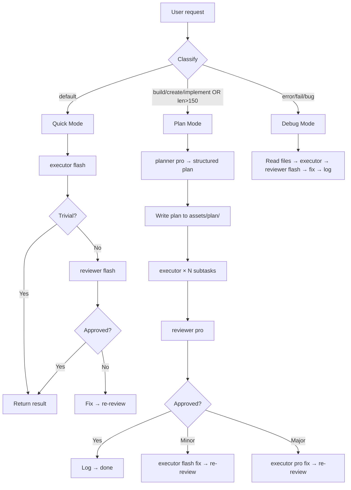

# ai-router

Routes complex tasks by planning, delegating to specialised sub-agents, and reviewing results. Supports custom model selection for each role.

> **Trigger:** `@ai-router`

## Quick Start

1. Type `@ai-router <task>` — the skill auto-classifies the request into **quick**, **plan**, or **debug** mode.
2. For **plan** mode: delegates to `ai-router-planner` → writes a plan to `assets/plan/` → delegates subtasks to `ai-router-executor` → reviews with `ai-router-reviewer`.
3. For **quick** mode: delegates directly to `ai-router-executor`; optionally reviewed by `ai-router-reviewer-flash`.
4. For **debug** mode: reads files, delegates to executor, reviews with flash reviewer, applies fix.

**Example:** `@ai-router add validation to login form` → classified as **plan** → planner generates subtasks → executor implements each → reviewer approves.

## Description

A formal pipeline (planner → executor → reviewer → fix loop) for complex, multi-step tasks. Unlike a flat agent, the router separates concerns: the planner thinks strategically, the executor writes code, and the reviewer catches mistakes. Each role can use a different model.

Keeps execution state in `assets/state/` (current plan, history) and saves dated plans to `assets/plan/`.

## Architecture

**Why severity-based retry?** Simple issues (naming, formatting) don't need a pro model to fix — flash handles them faster and cheaper. Complex issues (architecture, security) always use pro. This saves tokens without sacrificing quality.

## Prerequisites

Requires four subagents configured in `opencode.json` (run `@ai-router --init` to generate):

| Subagent | Role | Permission |
| :--- | :--- | :--- |
| `ai-router-planner` | Strategic planning | Full access |
| `ai-router-executor` | Fast code execution | Full access |
| `ai-router-reviewer` | Full review (plan mode) | Read-only + task |
| `ai-router-reviewer-flash` | Lightweight review (quick/debug) | Read-only + task |

## Pipeline Modes

| Mode | Trigger | Pipeline |
| :--- | :--- | :--- |
| **quick** | Default for short requests | executor(flash) → review(flash or skip) |
| **plan** | Action verbs (build/create/implement…) or length > 150 | planner(pro) → executor → review(pro) → [minor→flash fix \| major→pro fix] → log |
| **debug** | Query contains "error", "fail", "bug" | executor → review(flash) → fix → log |

## Configuration

| Path | Purpose |
| :--- | :--- |
| `.agents/skills/ai-router/SKILL.md` | Skill definition |
| `.agents/skills/ai-router/references/` | System prompts for each role |
| `.agents/skills/ai-router/assets/plan/` | Saved plans (dated filenames) |
| `.agents/skills/ai-router/assets/state/` | Current plan + execution history |

> [!NOTE]
> The pipeline writes plan files directly via the `write` tool — no delegation needed for that step. Only delegation to sub-agents uses the `task` tool.
>
> Reviewers can only read files and delegate tasks — they cannot edit or write directly.

---

<!-- Last updated: 2026-07-07 via @ai-docs update -->

**[⬆ Back to Top](#)** | **[📂 Skill Index](/docs/README.md)**
