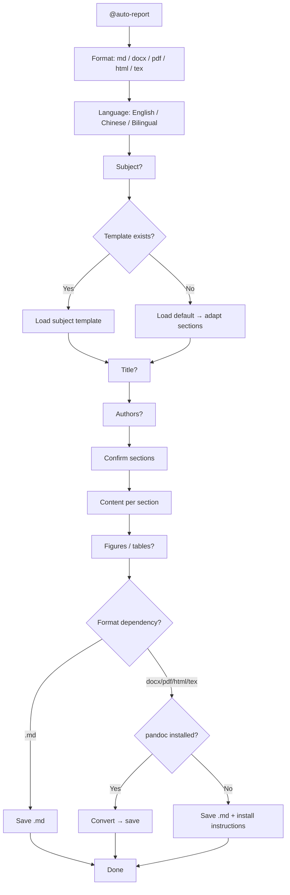

# auto-report

Interactive report generator. Asks one question at a time, fills a Markdown template, checks export dependencies, and saves the result.

> **Trigger:** `@auto-report` | `@auto-report --templates` | `@auto-report --history` | `@auto-report --config`

## Quick Start

1. Type `@auto-report` to start the wizard.
2. Answer: format → language → subject → title → authors → sections → content.
3. Skill checks dependencies, generates the report, and saves to `/docs/auto-report/`.

**Example:** `@auto-report` → .docx → English → "AI Ethics" → 3 authors → sections confirmed → pandoc found → saved as `edited_default_2026-06-30.docx`.

## Description

Interactive report builder that asks one question at a time. Adapts sections to the subject dynamically. Supports 5 export formats. Templates stored in `.agents/skills/auto-report/templates/`. No external dependencies required for Markdown output.

## Architecture



**Why one question at a time?** Reduces cognitive load, prevents form fatigue, and allows mid-session cancellation without data loss. Each answer is persisted immediately.

## Usage

| Command | Action |
| :--- | :--- |
| `@auto-report` | Full wizard: format → language → subject → title → authors → sections → content → export |
| `@auto-report --templates` | List available templates |
| `@auto-report --history` | Show past reports |
| `@auto-report --config` | View/edit saved settings |

## Dependencies — Read Carefully

This skill can always produce **Markdown (.md)** with zero dependencies. Other formats require external tools.

### pandoc (required for docx, pdf, html, tex)

pandoc converts Markdown to other formats. Without it, only .md output works.

**Install on Windows:**

```powershell
# Option A — winget (Windows 10+)
winget install pandoc

# Option B — Chocolatey
choco install pandoc

# Option C — Scoop
scoop install pandoc

# Option D — Manual
# Download from https://pandoc.org/installing.html
# Run the .msi installer, ensure "Add to PATH" is checked
```

**Verify installation:**

```powershell
pandoc --version
```

Expected output: `pandoc 3.x` followed by feature list.

### PDF engine (required for pdf output)

pandoc needs a PDF engine to produce .pdf. Three options:

**Option 1 — weasyprint (easiest for English reports)**

```powershell
pip install weasyprint
```

Verify: `python -c "import weasyprint; print(weasyprint.__version__)"`

**Option 2 — wkhtmltopdf (good for simple layouts)**

Download from https://wkhtmltopdf.org/downloads.html and install. Verify:

```powershell
wkhtmltopdf --version
```

**Option 3 — xelatex (required for Chinese/CJK PDFs)**

For Chinese University reports in PDF, you need a LaTeX distribution with CJK support:

```powershell
# Install MiKTeX (includes xelatex)
winget install MiKTeX.MiKTeX
# Or download from https://miktex.org/download
```

Verify:

```powershell
xelatex --version
```

### Summary table

| Format | Requires | Install command |
|--------|----------|----------------|
| .md | Nothing | — |
| .docx | pandoc | `winget install pandoc` |
| .html | pandoc | `winget install pandoc` |
| .tex | pandoc | `winget install pandoc` |
| .pdf (English) | pandoc + weasyprint | `winget install pandoc` + `pip install weasyprint` |
| .pdf (Chinese/CJK) | pandoc + xelatex | `winget install pandoc` + `winget install MiKTeX.MiKTeX` |

### Common errors

| Error | Cause | Fix |
|-------|-------|-----|
| "pandoc not found" | pandoc not installed or not in PATH | Run `winget install pandoc`, restart terminal |
| "pdf-engine not found" | No PDF engine installed | Install weasyprint or xelatex |
| "pdflatex not found" | Missing LaTeX distribution | Install MiKTeX (includes xelatex) |
| Chinese chars render as boxes | Missing CJK fonts or xelatex | Install MiKTeX + Chinese fonts |
| .docx but no pandoc | User chose docx without pandoc | Skill auto-falls back to .md |

## Output

All reports saved to `/docs/auto-report/edited_{template}_{date}.{ext}`. Past session data persisted to `/docs/auto-report/.config.md`.

## Templates

Located in `.agents/skills/auto-report/templates/<name>/template.md`. Built-in:

| Template | Use |
|----------|-----|
| `default` | Standard academic reports |
| `chinese-university` | Chinese university reports (GB/T 7714-2015) |

If the subject matches a template folder, it is used. Otherwise, the default template is adapted to the subject dynamically.

> [!TIP]
> No external deps needed for Markdown output. Only install pandoc if you need .docx/.pdf/.html/.tex.
>
> If your report includes Mermaid diagrams, include the `%%{init}%%` sizing directive per `docs/diagrams/README.md` to prevent oversized rendering.

---

**[⬆ Back to Top](#)** | **[📂 Skill Index](/docs/README.md)**

<!-- Last updated: 2026-07-07 via @ai-docs update -->
