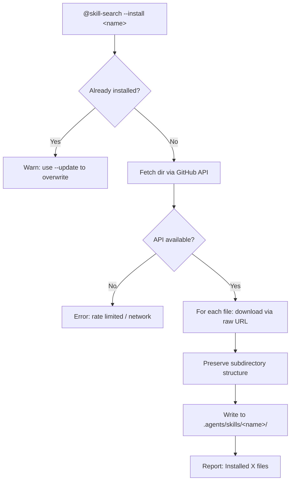

# skill-search

Browse, install, and update skills from the Echeq/myAI-Skills GitHub repository. Acts as a package manager for OpenCode skills.

> **Trigger:** `@skill-search` | `@skill-search --list` | `@skill-search --search` | `@skill-search --install` | `@skill-search --update` | `@skill-search --info`

## Quick Start

1. Type `@skill-search --list` to see all available skills on GitHub.
2. Type `@skill-search --install ai-audit` to download and install a skill.
3. Type `@skill-search --info ai-git` to see details before installing.

**Example:** `@skill-search --search audit` → finds ai-audit → `--install ai-audit` → downloaded to `.agents/skills/ai-audit/`.

## Description

Package manager for OpenCode skills. Fetches from the Echeq/myAI-Skills GitHub repository via API (listing) and raw content (downloading). Supports multi-file skills like ai-git (which has commit.md, branch.md, etc.).

## Architecture

**Why two data sources?** GitHub API (for listing) is rate-limited to 60 req/hour unauthenticated. Raw content downloads via `raw.githubusercontent.com` have no limit but need explicit file paths. The skill uses API for discovery and raw for content.

## Usage

| Command | Action |
| :--- | :--- |
| `@skill-search --list` | List all available skills with descriptions |
| `@skill-search --search <query>` | Search skills by name or keyword |
| `@skill-search --install <name>` | Download and install a skill from GitHub |
| `@skill-search --update <name>` | Re-download and overwrite an installed skill |
| `@skill-search --info <name>` | Show frontmatter details of a remote skill |

## Configuration

| Path | Purpose |
| :--- | :--- |
| `.agents/skills/<name>/` | Installed skills land here |
| GitHub: `Echeq/myAI-Skills` | Source repository |

> [!NOTE]
> GitHub API is rate-limited to 60 requests/hour unauthenticated. Raw content downloads via `raw.githubusercontent.com` have no limit.

> [!TIP]
> After installing a skill, run `@ai-docs` to regenerate the documentation index.

---

**[⬆ Back to Top](#)** | **[📂 Skill Index](/docs/README.md)**

<!-- Last updated: 2026-07-07 via @ai-docs update -->
